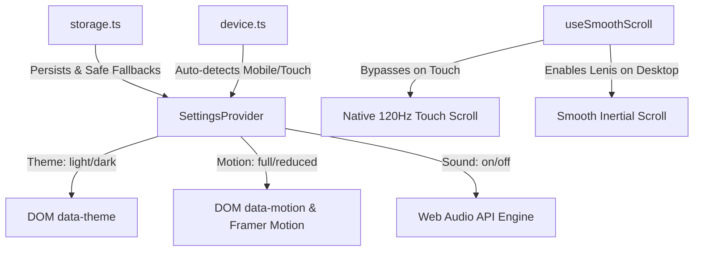

# 🏛️ Architecture Overview

This document provides a complete technical blueprint of the Luxe Portfolio application. It is designed so that any engineer or autonomous LLM agent can understand the system topology, rendering boundaries, data flow, and design system without reverse engineering the codebase.

---

## 1. System Topology & Technology Stack

* **Framework**: Next.js 14 (App Router) with React 18 and TypeScript.
* **Styling**: Tailwind CSS with custom CSS variables (`--ink`, `--paper`, `--neon`, `--neon2`, `--grad-a`, etc.), custom neumorphic utility classes (`.neo`, `.glass`, `.glass-strong`), and CSS hardware acceleration (`transform-gpu`, `will-change-transform`).
* **3D Graphics & Canvas**: Three.js, `@react-three/fiber` (R3F), and `@react-three/drei`. Loaded asynchronously via `next/dynamic({ ssr: false })` with dynamic power throttling (`dpr={[1, 1]}`, frame reduction on low-power/mobile devices, and fallback scene rendering via `ErrorBoundary`).
* **Animation & Motion**: Framer Motion for UI springs, layout transitions, and entrance animations, with automatic hardware/preference detection (`reducedMotion` and `data-motion="reduced"` mode).
* **Scrolling & Kinematics**: Lenis smooth scrolling with an explicit 120Hz native touch scroll bypass on mobile touch devices.
* **Persistence & Backend**: Supabase (PostgreSQL) for leads, testimonials, and view counts; Plunk REST API for transactional contact email and weekly digest dispatch.
* **Audio**: Custom Web Audio API synthesizer (`src/lib/sound.ts`) synthesizing subtle high-frequency ticks and whooshes without external MP3/WAV assets.

---

## 2. Directory Layout & Mental Model

```
portfolio_web/
├── docs/                           # Architectural, component, and performance documentation
│   ├── ARCHITECTURE.md             # This document (system overview & topology)
│   ├── COMPONENTS.md               # Design system UI primitives & specifications
│   ├── UTILITIES_AND_SERVICES.md   # Core libs, helpers, Supabase & Plunk integrations
│   ├── MOBILE_AND_PERFORMANCE.md   # Mobile touch, 120Hz scrolling, WebGL profiling
│   └── STANDARDS_AND_PATTERNS.md   # Coding conventions & LLM maintenance rules
├── public/                         # Static assets (images, favicon, CV PDF, sound fallbacks)
├── src/
│   ├── app/                        # Next.js App Router root
│   │   ├── layout.tsx              # Root layout, fonts, SEO metadata, theme bootstrapping
│   │   ├── page.tsx                # Homepage assembling all sections
│   │   ├── error.tsx               # Global root route error boundary
│   │   ├── not-found.tsx           # 404 page with animated compass and safe navigation
│   │   ├── admin/page.tsx          # Protected admin panel for testimonials & leads
│   │   ├── career/page.tsx         # Dedicated career & CV timeline page
│   │   └── api/                    # Serverless API route handlers
│   │       ├── contact/route.ts    # Contact form validation & Plunk dispatch
│   │       ├── digest/route.ts     # Weekly leads digest cron endpoint
│   │       ├── feedback/route.ts   # Community testimonials submission
│   │       ├── health/route.ts     # Health check endpoint
│   │       ├── projects/views/     # Supabase project view counter
│   │       └── vitals/route.ts     # Core Web Vitals beacon
│   ├── components/
│   │   ├── providers/              # React Context Providers (SmoothScroll, Settings)
│   │   ├── three/                  # WebGL Canvas scenes & 3D shaders
│   │   ├── ui/                     # Reusable design system primitives (Modal, Button, Card...)
│   │   └── sections/               # High-level section components (Hero, About, Projects...)
│   │       ├── projects/           # ProjectCard (Grid/List), ProjectModal, ProjectToolbar
│   │       └── contact/            # Multi-step contact form & validation
│   ├── data/                       # Static structured datasets (projects, articles, experience)
│   └── lib/                        # Single-source-of-truth utility modules
│       ├── api-utils.ts            # Standardized API response & JSON parser
│       ├── constants.ts            # SITE_CONFIG, URLs, social links
│       ├── device.ts               # Canonical touch, mobile, and low-power detection
│       ├── plunk.ts                # Plunk email client & transactional mailers
│       ├── settings.tsx            # Theme, motion, sound preferences state
│       ├── sound.ts                # WebAudio API sound engine
│       ├── storage.ts              # Safe localStorage wrapper with Safari Private mode guard
│       ├── supabase.ts             # Supabase client singleton & typings
│       └── utils.ts                # Class name merger (cn) & date formatters
```

---

## 3. Rendering Strategy: RSC vs. Client Components

* **Root & Metadata**: `src/app/layout.tsx` is a Server Component that outputs semantic HTML, OpenGraph tags, JSON-LD Schema, and pre-renders static font links and theme boot scripts.
* **Page Assembler**: `src/app/page.tsx` fetches Supabase data (testimonials, experiences, skills) on the server when configured, falling back to static fixtures, and hydrates individual section client islands.
* **Client Boundaries**: Interactive components (`Modal`, `NeumorphicButton`, `PortfolioScene`, `FilterTabs`, `Contact`) declare `"use client";` at the top. All client components must handle SSR gracefully without hydration warnings.

---

## 4. State Management Pipeline


